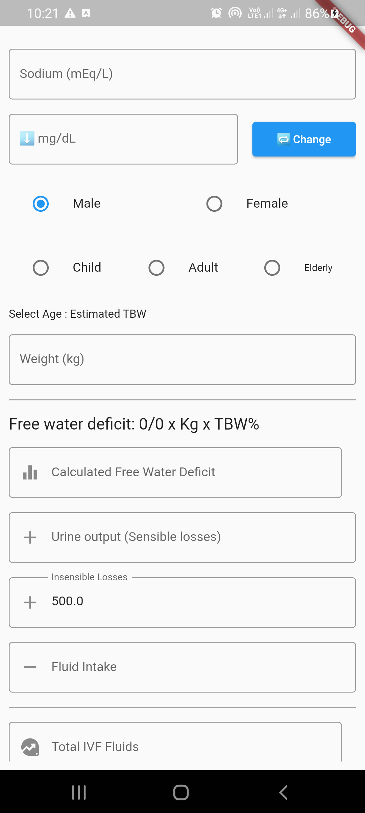
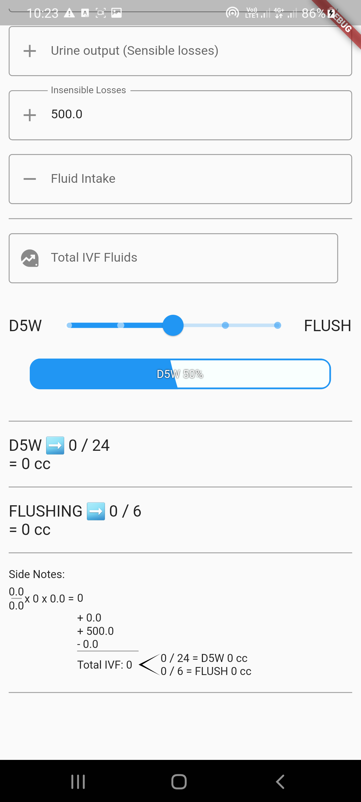

# IVF Hypernatremia Calculator - Easy Fluid Management for Medical Professionals

Go directly to the site:
https://niccoreyes.github.io/IVFcalculator/build/web/

## Getting Started
With the IVF Hypernatremia Calculator, managing fluid levels for IVF patients has never been easier.

* **Easy to use**: Simply enter the patient's age, gender, weight, and their sensible and insensible losses and the app will calculate the appropriate amount of flushing or fluids to administer.

* **Essential tool**: This app is an essential tool for any medical professional working in the field of IVF.

* **Accurate calculations**: The app uses a clinically validated formula to ensure accurate calculations.

* **Avoid Hypernatremia**: The app helps avoid the dangers of hypernatremia by ensuring patients receive the correct amount of fluids

* **Support**: If you have any questions or issues with the app, please feel free to contact me.

Download the IVF Hypernatremia Calculator now and start managing IVF patient fluids with ease.

<table border="0" cellpadding="0" cellspacing="0">
  <tr>
    <td>
      
    </td>
    <td>
      
    </td>
  </tr>
</table>

<!-- 
 -->